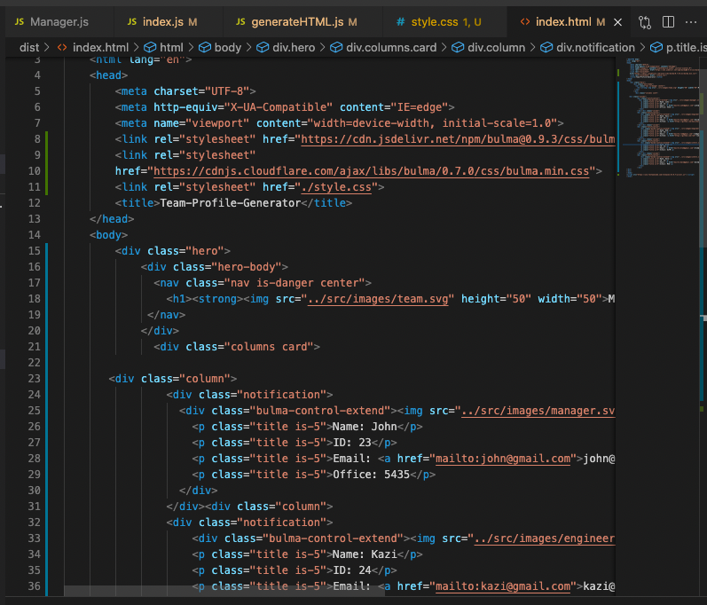

# Team Profile Generator

### Description:
```
Your challenge is to build a Node.js command-line application that takes in information about employees on a software engineering team and generates an HTML webpage that displays summaries for each person. Because testing is key to making code maintainable, you’ll also write unit tests for each part of your code and ensure that it passes all of them.

Because this application won’t be deployed, you’ll also need to provide a link to a walkthrough video that demonstrates its functionality and all of the tests passing. You’ll need to submit a link to the video and add it to the README of your project.
```
## User Story
```  
  AS A manager
  I WANT to generate a webpage that displays my team's basic info
  SO THAT I have quick access to their emails and GitHub profiles 
```

## Acceptance Criteria
``` GIVEN a command-line application that accepts user input
    WHEN I am prompted for my team members and their information
    THEN an HTML file is generated that displays a nicely formatted team roster based on user input
    WHEN I click on an email address in the HTML
    THEN my default email program opens and populates the TO field of the email with the address
    WHEN I click on the GitHub username
    THEN that GitHub profile opens in a new tab
    WHEN I start the application
    THEN I am prompted to enter the team manager’s name, employee ID, email address, and office number
    WHEN I enter the team manager’s name, employee ID, email address, and office number
    THEN I am presented with a menu with the option to add an engineer or an intern or to finish building my team
    WHEN I select the engineer option
    THEN I am prompted to enter the engineer’s name, ID, email, and GitHub username, and I am taken back to the menu
    WHEN I select the intern option
    THEN I am prompted to enter the intern’s name, ID, email, and school, and I am taken back to the menu
    WHEN I decide to finish building my team
    THEN I exit the application, and the HTML is generated
```


  

  ## Table of contents
  1. [Title](#title)
  2. [Description](#description)
  3. [Installation](#installation)
  4. [Usage](#usage)
  5. [Contributing](#contributing)
  6. [Test](#test)
  7. [License](#license)
  8. [Questions](#questions)

  ## Title
  Team Profile Generator

  ## Description
  This will prompt and generate Team Profile 

  ## Installation
  run `npm install` and `npm install inquirer`

  ## Usage
  run `node index.js`

  ## Contributing
  Always create a branch and do PR once ready

  ## Test
  test on local environment

  ## License
  [MIT](https://gist.github.com/nicolasdao/a7adda51f2f185e8d2700e1573d8a633#mit-license)

  ## Questions
  Do not have any question at this time<br />
  Find me on Github [kazichaska](https://github.com/kazichaska)<br />
  Email me with any question: kazichaska@gmail.com <br />

## Deployed Application Video Link 
Below is the recorded video link of deployed application and how to use it:
https://watch.screencastify.com/v/C9usibLmK5SLKxB2KJOw or below is on Youtube
https://youtu.be/kmkZhoNTm3Y 

## Screenshots of the code





